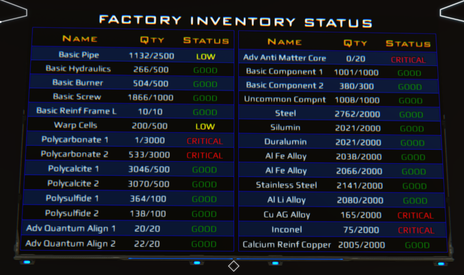
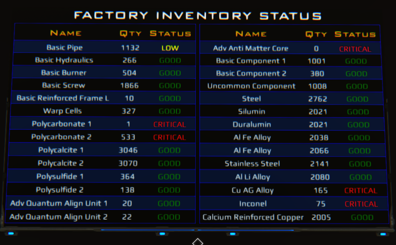
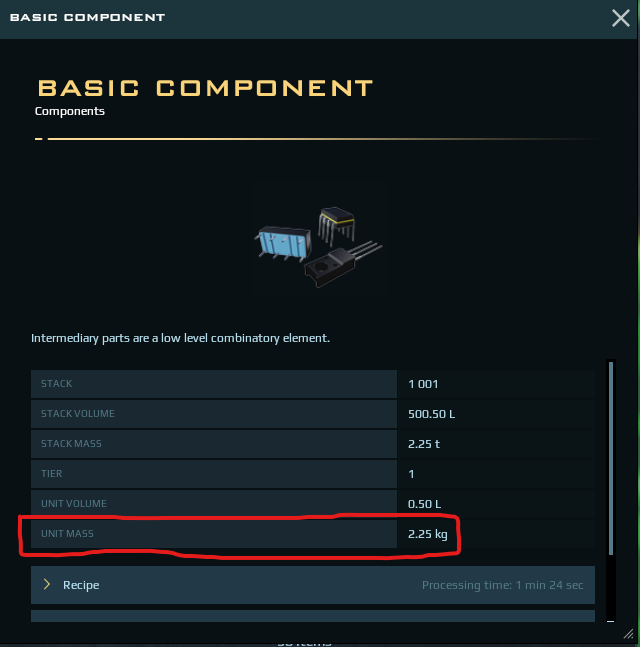

# Container Monitor

This script allows you to monitor the contents of up to 28 containers and display Name, Qty and Status on a screen.

## :page_with_curl: Elements Required

- 4 Programming Boards
- 3 Databanks
- 1 Manual Switch
- 1 Relay
- 1 M Screen

## :page_facing_up: Parameters Documentation

 
| Parameter | Description | Default value | Type |
| ------------- | ------------- | ------------- | ------------- |
| showSafetyStock | Displays safety stock along with Qty i.e 100/200 instead of 100 | true | Boolean |
| containerEnabled | Uncheck for Slots with container name you don't want to use. There is one flag per container | true | Boolean |
| DBenabled | Uncheck if not using all the boards/Databanks. One per DB | true | Boolean |
| criticalColor | Use to change the default red color for the CRITICAL Status | "red" | String |
| lowColor | Use to change the default yellow color for the LOW Status | "yellow" | String |
| goodColor | Use to change the default green color for the GOOD Status | "gree" | String |
| containerLabel | Name that will display on screen for the container. One per container | "Default Label" | String |
| containerDensity | The Unit Mass for the item being monitored inside the container | 0 | Number |
| containerSafetyStock | This is the optimal numer of units you want in the container, what you consider 100% | 0 | Number |
  

## :pushpin: Features

  
Display Qty or Qty/SafetyStock 

  
  
  
  

  
Change default status colors

  
  Use [this](https://www.quackit.com/css/color/charts/css_color_names_chart.cfm) to help you pick colors if needed

## :gear: Setup
To add each script to a Programming board: 
  1. Copy the script to your clipboard 
  2. Right-click on the Programming Board > Advanced > Copy Lua configuration from Clipboard
  3. Go into Build Mode(B) and use the Link Element Tool to link the board to each of of the elements ( screen, databanks, containers etc )

:boom:NOTE: Linking the right slot to the correct element is a MUST. This is where most people run into issues. I suggest linking one element at the time and going into the LUA script (hover over the programming board and press Ctrl+L or right-click on the programming board > Advanced > Edit LUA script ) to see which slot gets linked. If you link the elements out of order you will be displaying the wrong quantities and most likely getting script errros as the code will try to execute on the wrong elements.

### Primary Board
1. Add script to the board
2. Open the Lua Editor (hover over the programming board and press Ctrl+L or right-click on the programming board > Advanced > Edit LUA script ) and look at the order of the slots. 
3. Link the elements (Databanks, screen, switch, containers) in the correct order 
4. Link switch to Relay
5. Link Relay to screen and each Secondary Board. This will ensure when you turn on/off the primary board all other elements get turn on/off as well.
6. Edit the LUA Parameters ( Right-click on the Programming Board > Advanced > Edit LUA parameters)
 - title: Enter a title for the top of the screen. DO NOT remove the double quotes
 - showSafetyStock: This is checked by default. It will display the Qty/SafetyStock. Uncheck it if you want to only disply Qty on the screen. 
 - container1Enabled: This is checked by default. Uncheck it for any slots that are not used.
 NOTE: Disconnecting a container slot and leaving its Enabled flag checked will result on Script error.
 - container1Label: Enter the name of the item inside container1. DO NOT remove the double quotes. 
 NOTE: With elements that have long names you will have to get creative with how many characters you enter. If the Name goes into a second line it will push the last item of the table out of view so try keeping the names to a single line.
 - container1Density: Enter only a number that represents the Unit Mass for the item inside container1. See screenshot below.
 
 
 Inspect Item to see the Unit Mass 

 
 
 
 
 
 - container1SafetyStock: Enter a number representing a quantity you would consider optimal or "100%". i.e if you want to have 1000 units at all times in a container then enter 1000, the status of the item will change to LOW if the quantity drops to 50% and CRITICAL when it reaches 25% or 500 and 250 respectively in this example.

NOTE: Each container have their own Enabled,Label,Density and SafetyStock parameters so you will need to enter label, density and Safety stock values for EACH container.

### Secondary Boards
1. Add script to the board
2. Open the Lua Editor (hover over the programming board and press Ctrl+L or right-click on the programming board > Advanced > Edit LUA script ) and look at the order of the slots. 
3. Link the elements (Databanks, containers) in the correct order 
4. Edit LUA parameters

Finally turn off/on the Primary board to ensure everything is running fresh. Enjoy :)
